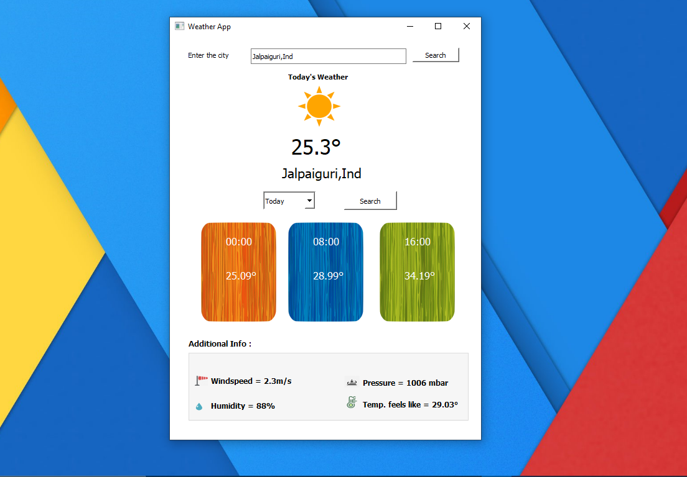
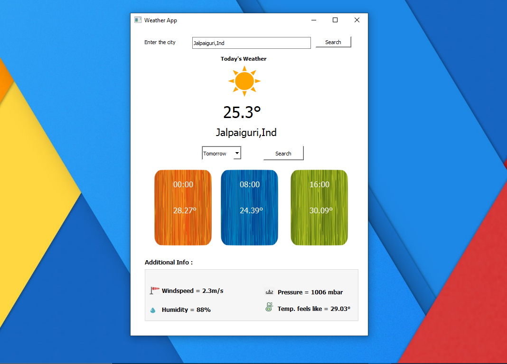
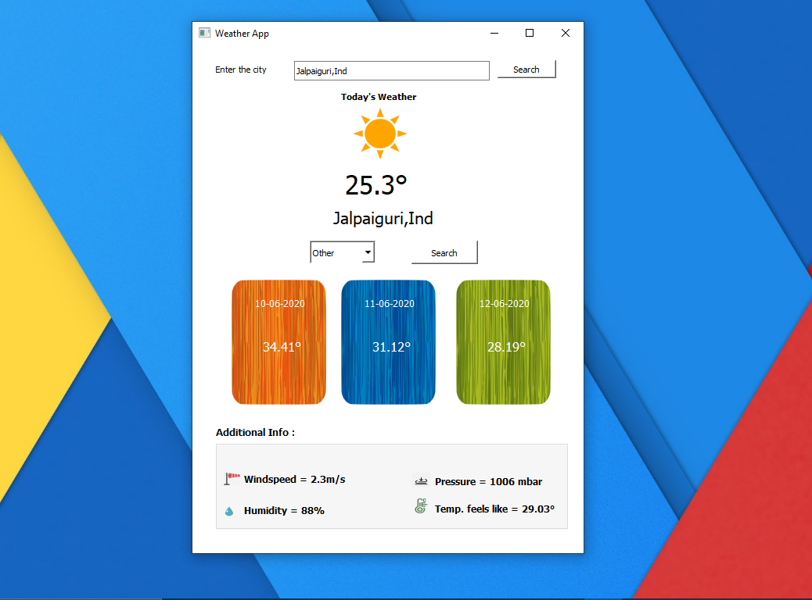
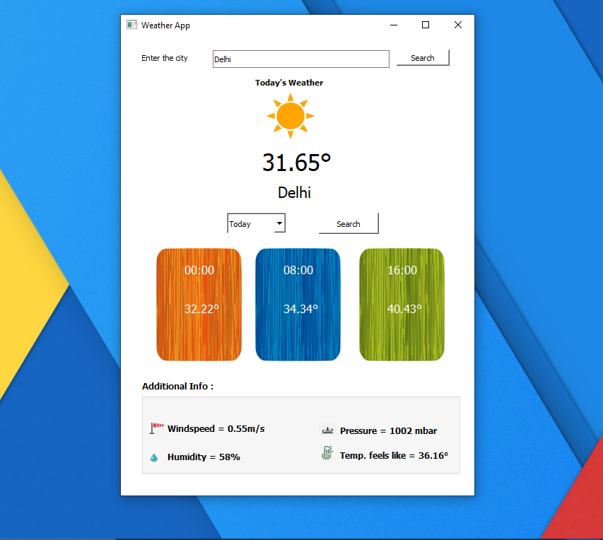
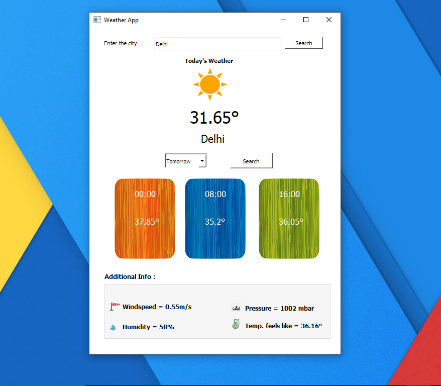
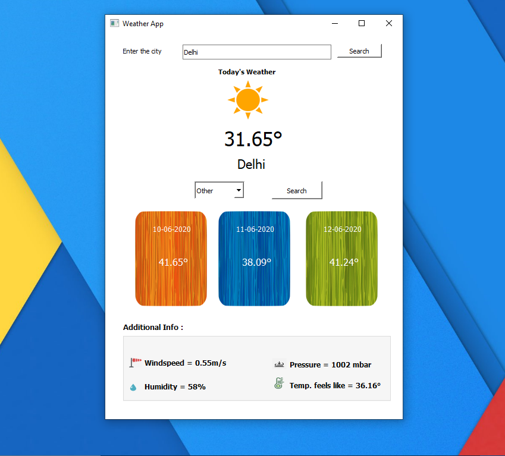

This project is a GUI based desktop application. 
This application is made by using "PYQT5" and "OpenWeatherApi".
This application gives you the the weather details for a location based on the user input.
In the application you can find a combobox, by using that you can find the weather for the next 5 days also, you just need to select value from combobox and click the search button.
Please find the screenshots below to get a view of the software.

